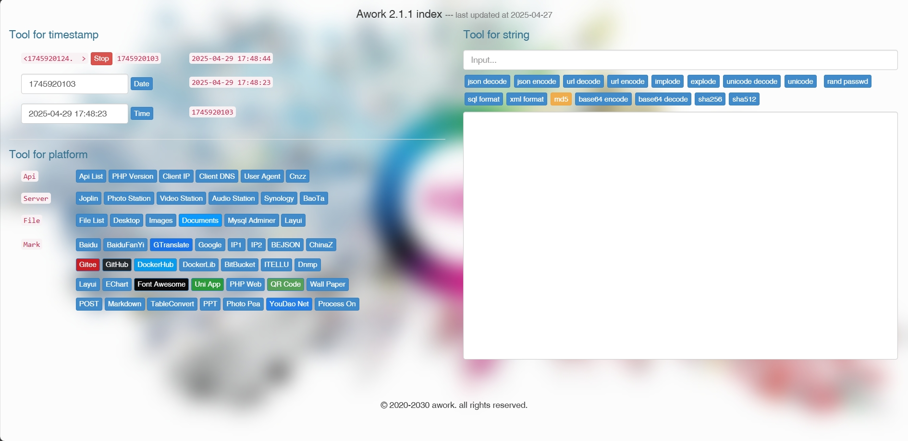

# **Smplote** :

## summary
    a tiny and simple framework.
    simple time toool and str tool for daily coding.



> catalog summary ：
```
/---
-----app                 应用文件夹
    |
    -----Console         命令行
    -----Exception       异常处理
    -----Http            前端控制器
    -----Http            监听器
    -----Models          模型文件
    -----Providers       提供器
    -----Service         服务类
-----bootstrap           Bootstrap
-----config              配置文件夹
-----database            数据库文件
-----lang                语言包
-----public              入口文件夹
    |
    -----.htaccess
    -----favicon.ico
    -----index.php       入口文件
-----resources           静态资源
-----routes              路由管理
-----storage
    |
    -----.logs           项目日志
-----tests               自动化测试
-----vendor              自动生成
-----.env.example        环境示例
-----composer.josn       必要依赖
-----README.md           文档说明

```

## quick start
```bash
git clone https://gitee.com/mounten2657/smplote.git

cp .env.example .env
composer install

php artisan key:generate
php artisan serve
```

finish：http://127.0.0.1

## License
- This project is free and open source, and there is no charge.
- This tool is for learning and technical research only and shall not be used for any commercial or illegal behavior.
- The author of this tool does not make any express or implied guarantee for the security, integrity, reliability, effectiveness, correctness or applicability of this tool, and does not assume any responsibility for any direct or indirect loss, liability, claim, demand or lawsuit caused by the use or abuse of this tool.
- The author of this tool reserves the right to modify, update, delete or terminate this tool at any time without prior notice or any obligation.
- Users of this tool should abide by relevant laws and regulations, respect the copyright and privacy of WeChat, shall not infringe the legitimate rights and interests of WeChat or other third parties, and shall not engage in any illegal or unethical behavior.
- When users of this tool download, install, run or use this tool, they are deemed to have read and agreed to this disclaimer. If you have any objection, please stop using this tool immediately and delete all related files.
- The code is only used for technical communication and learning, and is prohibited from being used in actual production projects. Please do not use it for illegal and commercial purposes! If any legal disputes arise from this, it has nothing to do with the author!


